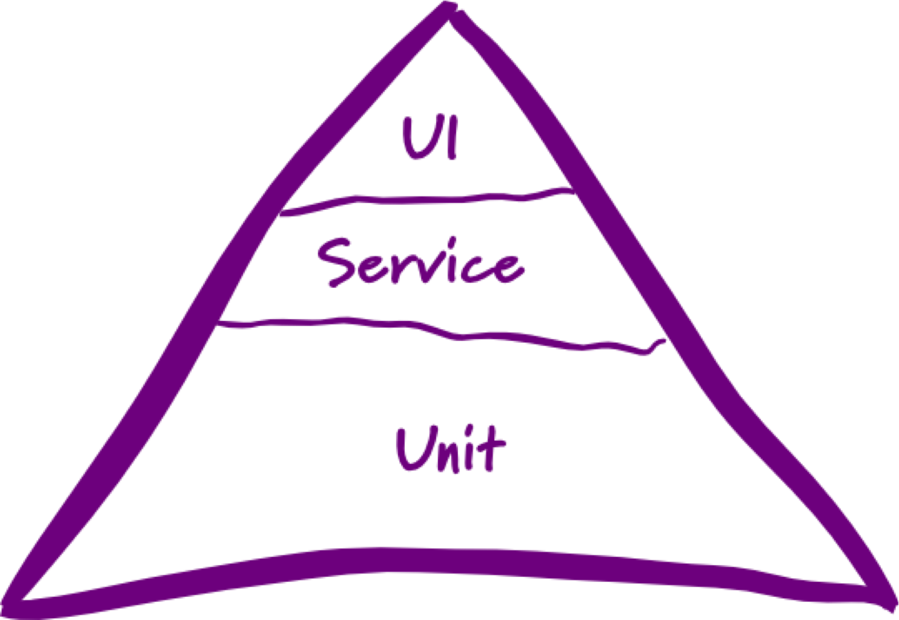

!SLIDE new-chapter center

# Transitioning to Continuous Delivery

!SLIDE

# Challenges

## 70% cultural > 30% technical

!SLIDE

# The Technical Challenge

Software has to be in releasable/deployable state all the time.

!SLIDE

# The Cultural Challenge

!SLIDE

# Cross Functional Teams / DevOps

* Optimize “Last Mile”
* QA + Ops as part of the team
* everyone is taking care of PROD
* you build it, you run it

!SLIDE

!SLIDE incremental

# DevOps Best Practices

* Regular Visits / Walk&Talk
* Pairing Culture / Force-To-Pair
* Developers Doing Production Support
* Production Metric Driven Requirements

!SLIDE

# Build Trust

* Automate testing
* Re-think the role of QA

!SLIDE

!SLIDE

!SLIDE

# Infrastructure As Code

* Automate server setup
* Goal: Full automation

!SLIDE

# Read

[http://pragprog.com/book/mnee/release-it](http://pragprog.com/book/mnee/release-it)

!SLIDE

# Read

[http://continuousdelivery.com/](http://continuousdelivery.com/)

~~~SECTION:notes~~~

What would you do when I'd be open fo losing control?

Was würde ich tun, wenn ich keine Angst hätte die Kontrolle zu
verlieren?

# Continuous deployment is a process

"Whereby all code that is written for an application is immediately deployed into production, which results in a reduction of cycle time."
– Eric Ries (Lean Startup)

A bad system will beat a good person every time
– W. Edwards Deming, Author of “Out of Crisis”

~~~ENDSECTION~~~
